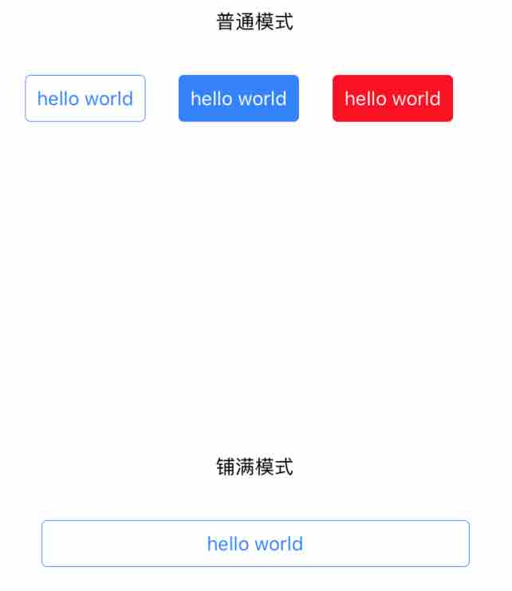
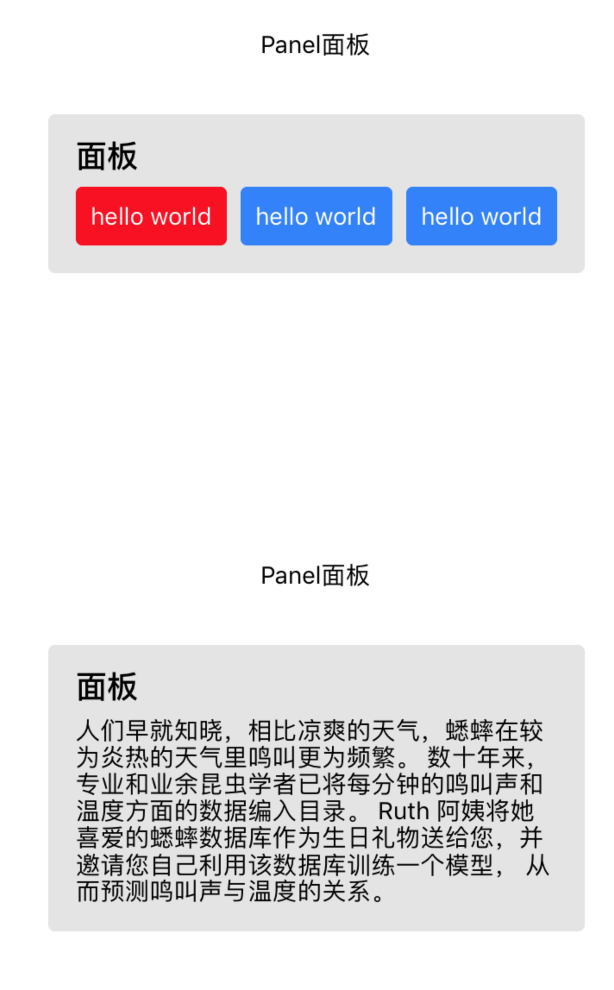
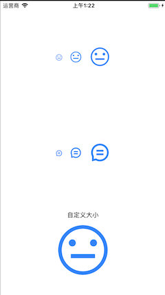

### 组件 

#### Button 

##### mode 显示模式 支持full normal 
##### type 样式模式 模式有primay nomal warn 
``` 
<EButton mode="full"
    type="normal"
    onPress={this._onPress}>
	hello world 
</EButton> 
```


#### Panel 

``` 
<EPanel
    title="面板"
  >
    <View style={{ width: '100%', justifyContent: 'space-between', flexDirection: 'row' }}>
      <Text>人们早就知晓，相比凉爽的天气，蟋蟀在较为炎热的天气里鸣叫更为频繁。
        数十年来，专业和业余昆虫学者已将每分钟的鸣叫声和温度方面的数据编入目录。
        Ruth 阿姨将她喜爱的蟋蟀数据库作为生日礼物送给您，并邀请您自己利用该数据库训练一个模型，
        从而预测鸣叫声与温度的关系。</Text>
    </View>
  </EPanel>
```



#### Icon

``` 
<EIcon 
	size="large"
	color="rgba(44, 126, 254, 1)"
	icon="icon_review_common"
/>

<Text>自定义大小</Text>
<EIcon 
	fontSize={128}
	color="rgba(44, 126, 254, 1)"
	icon="icon_review_good"
/>
```



#### TabItem

``` 
<ETabItem
	style={{ flex: 1 }}
	icon="icon_review_good"
	title="标题"
/>
<ETabItem
	style={{ flex: 1 }}
	title="标题"
/>
```

